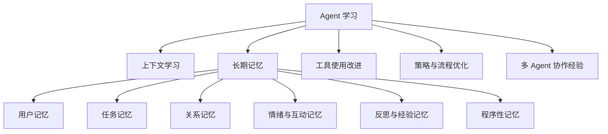

# Agent 学习与记忆模块需求文档

## 1. 模块定位

这个模块用于帮助用户系统理解「Agent 如何学习」，并重点展开「记忆」这一核心能力。它不是一篇纯技术科普，也不是 GitHub 仓库列表，而是一个面向产品设计与后续界面实现的信息模块。

目标用户是正在设计或实现个人 AI 助手、长期陪伴型 Agent、工作流 Agent、AI 伴随产品的人。用户进入模块后，应该能回答四个问题：

1. Agent 学习至少包括哪些能力？
2. 记忆在 Agent 学习体系里处于什么位置？
3. 不同 Agent 场景需要什么类型的记忆？
4. 如果要做 xiaoqing 这类产品，应该选哪种记忆策略，为什么？

## 2. 信息架构

建议将页面拆成 6 个主模块：

1. Agent 学习总览
2. 记忆能力深度展开
3. 场景类型对比：助手型、陪伴型、伴侣型
4. 记忆实现方式与技术路线
5. GitHub 参考仓库与研究跳转
6. xiaoqing 项目建议方案

页面不建议做成长篇文章阅读器，而应设计成「学习地图 + 对比表 + 决策卡片 + 参考链接」的组合。用户应该能快速扫视，也能逐层深入。

## 3. Agent 学习至少包括哪些

Agent 学习可以被拆成 7 类能力。它们之间不是并列孤岛，而是从「短期适应」逐步走向「长期演化」。

| 学习能力 | 说明 | 典型产物 | 适合场景 |
| --- | --- | --- | --- |
| 上下文学习 | 在当前会话中理解任务、约束、语气、文件、工具状态 | 当前对话上下文、临时任务状态 | 所有 Agent |
| 用户偏好学习 | 记住用户喜欢什么、不喜欢什么、常用表达、工作习惯 | 用户画像、偏好标签、写作风格 | 助手型、陪伴型 |
| 任务流程学习 | 记住用户反复执行的流程、步骤、项目规则 | Workflow、SOP、项目上下文 | 办公助手、开发助手 |
| 事实与关系学习 | 记住人物、项目、事件、组织、地点、对象之间的关系 | 知识图谱、实体关系、时间线 | 陪伴型、CRM、企业 Agent |
| 经验反思学习 | 从失败、纠正、反馈中总结下次怎么做得更好 | 经验片段、反思规则、失败案例 | 高阶助手、自动化 Agent |
| 行为风格学习 | 学习如何表达、如何回应、边界在哪里、什么时候主动 | Persona、沟通策略、主动性规则 | 陪伴型、伴侣型 |
| 自我改进学习 | Agent 根据长期反馈调整工具使用、提示词、策略或子 Agent 分工 | Prompt 优化、技能选择、策略配置 | 平台型 Agent、高自主 Agent |

### 包含关系

Agent 学习是上位概念，记忆是实现 Agent 学习的关键基础设施之一。



设计上应该让用户先理解「Agent 学习不等于记忆」，再进入记忆细分。这样可以避免用户误以为只要加向量库就是会学习。

## 4. 记忆模块深度展开

### 4.1 记忆的产品定义

在 Agent 产品里，记忆不是简单保存聊天记录，而是让 Agent 在未来的交互中更懂用户、更稳定、更少重复、更能延续关系或任务。

一条可用记忆通常需要包含：

| 字段 | 作用 |
| --- | --- |
| 内容 | 记住的事实、偏好、事件、经验或规则 |
| 类型 | 偏好、事实、关系、任务、情绪、反思、禁忌等 |
| 来源 | 来自哪次对话、文件、用户确认、系统事件 |
| 时间 | 发生时间、记录时间、更新时间、失效时间 |
| 置信度 | 是用户明确说的，还是 Agent 推断的 |
| 可见性 | 用户是否能看到、编辑、删除 |
| 使用条件 | 什么情况下应该召回，什么情况下不该用 |
| 敏感级别 | 是否涉及隐私、关系、身份、健康、财务等 |

### 4.2 记忆类型

| 记忆类型 | 记什么 | 例子 | 价值 | 风险 |
| --- | --- | --- | --- | --- |
| 短期上下文记忆 | 当前对话和任务状态 | 用户刚说“这版先别改颜色” | 保持当前任务连贯 | 会话结束后丢失 |
| 长期用户画像记忆 | 稳定偏好、身份、习惯 | 用户偏好中文回答、喜欢简洁方案 | 个性化体验 | 画像误判会冒犯用户 |
| 任务/项目记忆 | 项目规则、文件结构、业务目标 | xiaoqing 使用陪伴型定位，不做强伴侣化 | 减少重复说明 | 过期规则污染新任务 |
| 事件/情节记忆 | 发生过的互动、里程碑、承诺 | 上周用户完成 Day 3 页面拆解 | 陪伴感和连续性 | 容易变成无意义流水账 |
| 关系记忆 | 人、项目、物品、地点之间的关系 | 用户把 xiaoqing 当作日常陪伴助手 | 支持复杂理解 | 需要时间、来源和冲突处理 |
| 情绪/状态记忆 | 用户长期状态、压力、喜好氛围 | 用户最近希望被温和提醒，不要催促 | 提升情感贴合 | 敏感度高，必须谨慎 |
| 程序性记忆 | 怎么做某类事的步骤 | 每次发版前先检查截图和本地预览 | 提升执行质量 | 错误流程会被固化 |
| 反思记忆 | 失败原因、用户纠正、经验总结 | 之前过度展开理论，用户更想要可执行 MD | 让 Agent 越用越顺手 | 需要区分事实和推断 |
| 安全边界记忆 | 不能做什么、需要确认什么 | 不自动提交敏感信息，不擅自强情感化 | 控制风险 | 过严会影响体验 |

## 5. 场景类型：助手型、陪伴型、伴侣型

这三类是产品定位，不是技术栈。它们可以共享记忆基础设施，但记忆重点、交互边界和风险完全不同。

### 5.1 助手型 Agent

助手型 Agent 的核心价值是帮用户完成任务。

| 维度 | 定义 |
| --- | --- |
| 用户想实现什么 | 更快完成工作、减少重复说明、自动化流程、提高决策质量 |
| 产品定位 | 工具型、效率型、任务导向 |
| 典型场景 | 编程助手、文档助手、日程助手、客服助手、研究助手 |
| 记忆重点 | 用户偏好、项目规则、任务流程、工具使用习惯、历史决策 |
| 不应该强调 | 情绪依恋、强人格关系、暧昧表达 |
| 成功标准 | 更准确、更省事、更可控、更少重复问 |

适合的记忆方案：

1. 短期上下文 + 长期偏好
2. 项目/任务记忆
3. 程序性记忆
4. 轻量反思记忆

### 5.2 陪伴型 Agent

陪伴型 Agent 的核心价值是陪用户长期成长、记录、复盘、提醒和回应。

| 维度 | 定义 |
| --- | --- |
| 用户想实现什么 | 有一个长期理解自己的 AI，同步生活/学习/项目状态，获得稳定陪伴与反馈 |
| 产品定位 | 关系弱于伴侣，能力强于普通助手；偏“日常同伴 + 成长教练 + 轻任务助手” |
| 典型场景 | 学习陪伴、情绪记录、习惯养成、个人成长、创作陪跑、日常助理 |
| 记忆重点 | 用户阶段、目标、情绪倾向、生活节奏、重要事件、互动习惯 |
| 不应该强调 | 排他关系、恋爱承诺、控制用户社交、替代真实关系 |
| 成功标准 | 用户感觉被理解、被持续跟进，但仍保有自主感和边界 |

适合的记忆方案：

1. 长期用户画像
2. 事件/情节记忆
3. 情绪/状态记忆
4. 目标与习惯记忆
5. 可编辑、可删除、可回顾的记忆面板

### 5.3 伴侣型 Agent

伴侣型 Agent 的核心价值是模拟更强的亲密关系体验。它比陪伴型更重情绪、更重关系连续性，也更高风险。

| 维度 | 定义 |
| --- | --- |
| 用户想实现什么 | 获得持续亲密回应、情感确认、关系仪式感、专属感 |
| 产品定位 | 情感关系型、人格化、强陪伴 |
| 典型场景 | AI 恋人、虚拟伴侣、长期人格角色互动 |
| 记忆重点 | 关系历史、称呼、纪念日、情绪触发点、偏好表达、关系规则 |
| 必须控制 | 依赖风险、心理健康误导、过度承诺、操控式表达、隐私暴露 |
| 成功标准 | 情感连续性强，但边界清晰，用户始终知道它是 AI |

适合的记忆方案：

1. 高细节关系记忆
2. 情绪状态与互动偏好
3. 纪念日与关系事件
4. 明确的安全边界记忆
5. 用户可控的记忆开关和删除机制

### 5.4 三类场景对比

| 对比项 | 助手型 | 陪伴型 | 伴侣型 |
| --- | --- | --- | --- |
| 核心目标 | 完成任务 | 长期陪跑 | 亲密关系体验 |
| 用户关系 | 工具信任 | 熟悉与理解 | 情感依恋 |
| 主动性 | 低到中 | 中 | 中到高 |
| 记忆粒度 | 偏任务和规则 | 偏用户状态和事件 | 偏关系细节 |
| 情绪权重 | 低 | 中 | 高 |
| 风险等级 | 中 | 中高 | 高 |
| 推荐给 xiaoqing | 部分适合 | 最适合 | 谨慎，不建议作为主定位 |

## 6. xiaoqing 项目定位判断

xiaoqing 更适合定位为「陪伴型偏助手」。

它不是纯助手型，因为用户显然希望它有连续记忆、熟悉感、长期陪伴感；但它也不应该直接定位成伴侣型，因为伴侣型会引入强情感承诺、依赖管理、亲密边界和安全风险，产品设计成本会陡增。

### 推荐定位

> xiaoqing 是一个长期陪伴型 AI 助手：记得用户的项目、习惯、阶段目标和互动偏好，在日常工作、学习、创作和复盘中提供稳定陪跑。

### 为什么选陪伴型偏助手

1. 用户真实目标不是只要一个聊天对象，而是希望 AI 能长期理解自己、跟进项目、减少重复沟通。
2. 陪伴型允许保留温度和熟悉感，但不需要进入伴侣型的亲密承诺。
3. 对界面设计更友好，可以做成「记忆地图」「成长轨迹」「项目上下文」「互动偏好」等可解释模块。
4. 对技术实现更稳，可以从偏好记忆、项目记忆、事件记忆开始，逐步加入情绪和反思记忆。
5. 对安全边界更清晰，避免产品被单一情感关系框死。

### xiaoqing 首版记忆范围

首版不要一上来做全量“人格大脑”。建议做 5 类记忆：

| 优先级 | 记忆类型 | 首版要做什么 |
| --- | --- | --- |
| P0 | 用户偏好 | 语言、回答长度、设计审美、工作方式、禁忌 |
| P0 | 项目记忆 | 当前项目、目标、目录、技术栈、规则、进展 |
| P1 | 事件记忆 | 最近完成的任务、重要反馈、阶段节点 |
| P1 | 反思记忆 | 用户纠正过的问题、下次应避免的做法 |
| P2 | 情绪/状态记忆 | 用户最近的节奏、压力、希望被如何提醒 |

首版应该明确不做：

1. 恋爱化关系系统
2. 高强度情绪诊断
3. 自动保存所有聊天记录
4. 不可解释的黑箱画像
5. 用户无法删除的长期记忆

## 7. 主流记忆实现方式

### 7.1 按存储形态划分

| 方式 | 说明 | 优点 | 缺点 | 适合 |
| --- | --- | --- | --- | --- |
| 原始聊天记录 | 保存完整对话，需要时检索或摘要 | 实现简单，证据完整 | 噪声大、成本高、隐私压力大 | 审计、回放、轻量 MVP |
| 摘要记忆 | 将对话压缩成阶段摘要 | 成本低，读起来清楚 | 容易丢细节和来源 | 陪伴日志、阶段复盘 |
| 结构化字段 | 用 profile、preference、project 等字段保存 | 可控、可编辑、好展示 | 灵活性较弱 | xiaoqing 首版 |
| 向量记忆 | 用 embedding 检索相关片段 | 语义召回方便 | 可能召回错、难解释 | 通用助手、知识问答 |
| 关键词/BM25 | 基于关键词检索 | 可解释、成本低 | 语义能力弱 | 名称、项目、明确事实 |
| 混合检索 | 向量 + 关键词 + 重排 | 召回更稳 | 系统复杂度更高 | 中长期产品 |
| 知识图谱 | 建实体、关系、时间与来源 | 适合关系和时间推理 | 建模和维护成本高 | 长期陪伴、企业知识 |
| 时间线记忆 | 按日期、事件、阶段组织 | 适合回顾和陪伴感 | 不适合复杂语义检索 | 陪伴型、成长型 |
| 反思/经验库 | 存失败、纠正和策略 | 能让 Agent 越用越顺 | 需要质量控制 | 高阶助手 |

### 7.2 按写入方式划分

| 写入方式 | 说明 | 适合场景 |
| --- | --- | --- |
| 用户显式保存 | 用户说“记住这个”或手动添加 | 高价值偏好、敏感信息 |
| Agent 自动抽取 | 每轮对话后抽取可能有用的记忆 | 普通偏好、项目事实 |
| 后台批处理整理 | 定时总结、去重、合并、过期 | 长期陪伴、知识库 |
| 工具事件写入 | 工具执行成功/失败后记录经验 | 工作流 Agent |
| 用户确认后写入 | Agent 提议保存，用户点确认 | 情绪、身份、关系类记忆 |

xiaoqing 推荐组合：

1. P0 记忆采用用户显式保存 + Agent 提议保存。
2. 项目记忆可自动抽取，但需要在记忆面板可编辑。
3. 情绪/关系类记忆必须用户确认后写入。
4. 反思记忆可以后台生成，但应标注“推断/总结”。

### 7.3 按召回方式划分

| 召回方式 | 说明 | 适合 |
| --- | --- | --- |
| 固定注入 | 每次都把核心记忆放进系统上下文 | 少量稳定偏好 |
| 语义搜索 | 根据用户当前问题检索相关记忆 | 大多数长期记忆 |
| 时间窗口 | 召回最近一段时间事件 | 陪伴感、阶段复盘 |
| 实体关系查询 | 根据人、项目、对象查关系 | 图谱型记忆 |
| 规则触发 | 特定任务或页面触发特定记忆 | 项目规则、工作流 |
| Agent 自主搜索 | Agent 判断何时查记忆 | 高级助手 |

首版建议：

1. 固定注入少量核心偏好。
2. 项目/事件记忆用语义搜索 + 时间窗口。
3. 不要让所有记忆都默认进入上下文，避免污染回答。

## 8. GitHub 参考仓库

以下仓库可作为不同技术路线的参考，不建议全部照搬。

| 仓库 | 定位 | 适合参考什么 | 对 xiaoqing 的价值 |
| --- | --- | --- | --- |
| [letta-ai/letta](https://github.com/letta-ai/letta) | Stateful agents with advanced memory | Agent 作为长期状态实体、memory blocks、工具与记忆结合 | 适合参考“Agent 记忆平台架构” |
| [mem0ai/mem0](https://github.com/mem0ai/mem0) | Universal memory layer for AI agents | add/search/update 的通用记忆 API、跨应用记忆层 | 适合参考“轻量接入和 SDK 体验” |
| [langchain-ai/langmem](https://github.com/langchain-ai/langmem) | LangGraph 生态记忆工具 | hot path/background memory、memory tools | 适合参考“Agent 何时主动管理记忆” |
| [getzep/graphiti](https://github.com/getzep/graphiti) | Temporal context graph for AI agents | 时间感知知识图谱、事实有效期、来源追踪 | 适合参考“关系和时间变化记忆” |
| [topoteretes/cognee](https://github.com/topoteretes/cognee) | Memory control plane / graph memory | 文档、表格、对话到图谱记忆 | 适合参考“个人知识库和项目记忆融合” |
| [supermemoryai/supermemory](https://github.com/supermemoryai/supermemory) | Memory engine and API | 统一 memory API、RAG、用户资料、连接器 | 适合参考“产品化 memory API” |
| [vectorize-io/hindsight](https://github.com/vectorize-io/hindsight) | Agent memory that learns from experience | retain/recall/reflect、错误经验和反思记忆 | 适合参考“从失败中学习” |

### 已有研究报告关联

当前项目已经有 Letta 研究产物：

1. `reports/repo-research/letta-research.html`
2. `reports/repo-research/letta-memory.json`

建议在 Agent 学习模块中增加「研究报告」区域：

| 链接 | 展示名 | 作用 |
| --- | --- | --- |
| `../../reports/repo-research/letta-research.html` | Letta / MemGPT 深度研究报告 | 打开完整 HTML 研究页 |
| `../../reports/repo-research/letta-memory.json` | Letta 结构化研究数据 | 给后续页面或卡片读取 |

如果页面部署在 GitHub Pages，需要注意 `reports/` 目前不在 `docs/` 目录下，默认不会被 GitHub Pages 发布。后续实现界面时有两个选择：

1. 将研究报告复制或生成到 `docs/reports/` 下，方便站内跳转。
2. 保留在 `reports/` 下，仅作为本地研究资料，不在前端页面直接链接。

推荐选择第 1 种，因为用户明确希望“和这里关联跳转”。

## 9. 模块页面设计建议

### 9.1 首屏

首屏不要做营销式 Hero。建议直接进入学习地图：

1. 标题：Agent 学习与记忆
2. 一句话定位：从 Agent 如何学习，到不同产品场景如何设计记忆系统。
3. 三个入口卡：
   - Agent 学习地图
   - 记忆类型拆解
   - xiaoqing 推荐方案

### 9.2 核心交互

建议做 4 种主要交互：

| 交互 | 说明 |
| --- | --- |
| 场景切换 | 助手型 / 陪伴型 / 伴侣型 segmented control |
| 记忆类型筛选 | 按用户画像、项目、事件、情绪、反思筛选 |
| 技术路线对比 | 切换“简单 MVP / 中期产品 / 高级架构” |
| 参考仓库跳转 | 每个仓库卡片跳到 GitHub 或本地研究报告 |

### 9.3 推荐页面结构

```text
Agent 学习与记忆
├─ 学习地图
│  ├─ 上下文学习
│  ├─ 长期记忆
│  ├─ 工具使用改进
│  └─ 策略反思
├─ 记忆类型
│  ├─ 用户画像
│  ├─ 项目记忆
│  ├─ 事件时间线
│  ├─ 关系图谱
│  ├─ 情绪状态
│  └─ 反思经验
├─ 场景定位
│  ├─ 助手型
│  ├─ 陪伴型
│  └─ 伴侣型
├─ 技术路线
│  ├─ 结构化字段
│  ├─ 向量检索
│  ├─ 混合检索
│  ├─ 时间线
│  └─ 知识图谱
├─ xiaoqing 方案
│  ├─ 推荐定位
│  ├─ 首版记忆范围
│  ├─ 不做什么
│  └─ 未来演进
└─ 参考资料
   ├─ GitHub 仓库
   └─ 本地研究报告
```

## 10. xiaoqing 记忆方案建议

### 10.1 首版数据模型

建议先用结构化记忆模型，不要一开始完全依赖向量库。

```ts
type MemoryItem = {
  id: string;
  userId: string;
  agentId: string;
  type:
    | "preference"
    | "project"
    | "event"
    | "reflection"
    | "relationship"
    | "emotional_state"
    | "safety_boundary";
  title: string;
  content: string;
  source: "user_confirmed" | "agent_extracted" | "tool_event" | "manual";
  confidence: number;
  sensitivity: "low" | "medium" | "high";
  createdAt: string;
  updatedAt: string;
  expiresAt?: string;
  tags: string[];
  relatedProjectId?: string;
  relatedEntityIds?: string[];
};
```

### 10.2 首版界面模块

| 模块 | 作用 |
| --- | --- |
| 我的长期偏好 | 用户能看到 xiaoqing 记住了什么偏好 |
| 项目上下文 | 当前项目的目标、规则、进度、关键决策 |
| 最近事件 | 按时间线展示最近重要互动 |
| 下次要更好的地方 | 展示反思记忆，例如用户纠正过的点 |
| 记忆权限 | 控制自动记忆、确认后记忆、关闭敏感记忆 |

### 10.3 记忆写入规则

| 规则 | 要求 |
| --- | --- |
| 用户明确说“记住” | 直接保存，但仍可编辑 |
| 涉及身份、情绪、关系 | 需要用户确认 |
| 涉及项目规则 | 可以自动保存，并在项目记忆中展示 |
| 涉及推断 | 必须标注“推断”或“总结” |
| 用户删除 | 立即从活跃记忆中移除 |
| 过期信息 | 不删除，转入历史或降低权重 |

## 11. 未来演进路线

| 阶段 | 目标 | 技术策略 |
| --- | --- | --- |
| V1 | 可见、可控、可编辑的基础记忆 | 结构化字段 + 手动确认 |
| V2 | 更好的召回和项目连续性 | 向量检索 + 时间线 |
| V3 | 关系和状态变化理解 | 知识图谱 + 时间有效期 |
| V4 | 从纠错和失败中学习 | 反思记忆 + 经验库 |
| V5 | 多 Agent 共享上下文 | 用户级记忆空间 + Agent 级权限 |

## 12. 设计交付要求

请 Claude Code Design 基于这份需求先做信息架构和界面方案，不要直接进入复杂实现。

设计时需要输出：

1. 页面整体布局
2. 核心模块优先级
3. 三类场景对比组件
4. 记忆类型卡片组件
5. xiaoqing 推荐方案模块
6. GitHub 仓库参考与本地研究报告跳转模块
7. 移动端适配方式

视觉风格建议：

1. 不要做成营销落地页。
2. 更像一个学习控制台或知识地图。
3. 信息密度中等，适合反复查阅。
4. 表格和卡片都要服务于比较和决策，不要为了装饰堆卡片。
5. 对“伴侣型”保持克制表达，避免暧昧化视觉。

## 13. 参考资料

外部参考：

1. [Letta](https://github.com/letta-ai/letta): stateful agents with advanced memory.
2. [Mem0](https://github.com/mem0ai/mem0): universal memory layer for AI agents.
3. [LangMem](https://github.com/langchain-ai/langmem): memory tools for agents that learn and adapt over time.
4. [Graphiti](https://github.com/getzep/graphiti): temporal context graphs for AI agents.
5. [Cognee](https://github.com/topoteretes/cognee): memory control plane for AI agents.
6. [Supermemory](https://github.com/supermemoryai/supermemory): memory engine and API.
7. [Hindsight](https://github.com/vectorize-io/hindsight): agent memory focused on retain, recall, and reflect.

内部参考：

1. `reports/repo-research/letta-research.html`
2. `reports/repo-research/letta-memory.json`

## 14. 结论

这个模块应把「Agent 学习」作为总框架，把「记忆」作为重点展开对象，把「助手型、陪伴型、伴侣型」作为产品场景决策工具。

xiaoqing 推荐选择「陪伴型偏助手」定位：保留长期理解和温度，但不进入强伴侣化产品边界。首版记忆系统应优先做到可见、可控、可编辑，再逐步增加向量检索、时间线、图谱和反思能力。
