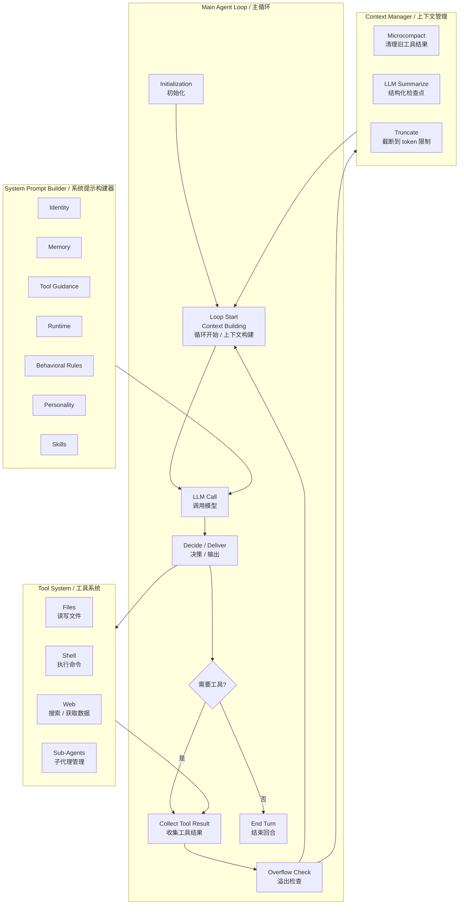

# Agent Runtime 主循环架构图卡

## 场景

- 看到一张 Agent Runtime 架构图，但容易只记住“LLM 调工具”这条线。
- 想理解 Codex、Claude Code、OpenClaw 这类编程 Agent 为什么能连续执行、调用工具、压缩上下文、恢复任务。
- 需要把图里的模块整理成可复用的心智模型，后续分析其他 Agent 框架时能快速对齐。

## 关键判断

这张图不是在讲“一个模型怎么回答问题”，而是在讲“一个 Agent Runtime 怎么调度一次又一次模型调用”。

可以分成四层看：

- `Main Agent Loop`：负责驱动回合，是调度器。
- `System Prompt Builder`：负责塑造模型行为，是行为配置层。
- `Tool System`：负责给模型外部能力，是执行层。
- `Context Manager`：负责控制上下文长度，是记忆与压缩层。

## 图的整理版

## 原理

Agent 的一次“工作”通常不是单次模型调用，而是一个循环：

1. Runtime 先加载系统规则、用户目标、历史上下文和可用工具。
2. Prompt Builder 把身份、记忆、工具说明、行为规则、人格、技能等内容组装成系统提示。
3. LLM 根据当前上下文决定：直接回复，还是调用工具。
4. 如果调用工具，Runtime 收集工具结果，把结果追加回上下文，再进入下一轮 LLM Call。
5. 当上下文接近上限时，Context Manager 通过微压缩、总结或截断，让循环继续运行。

所以 Agent 能“连续做事”的关键，不只是模型本身，而是 Runtime 在背后不断完成：

- 组装提示。
- 提供工具。
- 收集结果。
- 管理上下文。
- 再次调用模型。

## 模块拆解

### Main Agent Loop

主循环是整个系统的核心调度器。

它决定什么时候调用模型、什么时候执行工具、什么时候结束当前回合、什么时候压缩上下文。编程 Agent 的“自动推进感”主要来自这一层。

### System Prompt Builder

系统提示构建器决定模型的行为边界和工作风格。

常见输入包括：

- `Identity`：模型当前扮演什么角色。
- `Memory`：长期偏好、项目记忆、历史经验。
- `Tool Guidance`：什么时候用工具、如何用工具。
- `Runtime`：当前环境、路径、权限、时间。
- `Behavioral Rules`：安全规则、协作规则、输出规范。
- `Personality`：语气、风格、互动方式。
- `Skills`：可按需加载的专项流程。

### Tool System

工具系统让 LLM 从“会说”变成“能做”。

核心工具通常是：

- `Files`：读写项目文件。
- `Shell`：运行构建、测试、脚本、Git 等命令。
- `Web`：搜索、读取外部资料、获取最新信息。

更复杂的 Runtime 还会支持子代理：

- `Explore read-only`：只读探索，适合并行调研。
- `General all tools`：可使用完整工具，适合拆分复杂任务。

### Context Manager

上下文管理器负责避免 Agent 因 token 超限而中断。

常见策略：

- `Microcompact`：清理旧的、低价值的工具输出。
- `LLM Summarize`：把已有过程总结成结构化检查点。
- `Truncate`：在必要时按上限裁剪上下文。

这层决定了 Agent 长任务中的“记忆质量”。压缩得好，后续还能保持方向；压缩得差，就容易丢失关键约束。

## 稳定解法

以后看 Agent 架构图，可以按这 5 个问题拆：

- 谁在驱动循环？看 `Main Agent Loop`。
- 模型看到什么规则？看 `System Prompt Builder`。
- 模型能做什么动作？看 `Tool System`。
- 工具结果怎么回到模型？看 `Collect Tool Result` 到下一轮 `LLM Call`。
- 上下文快满了怎么办？看 `Context Manager`。

判断一个 Agent 框架是否可靠，也可以看这四层是否清楚：

- Loop 是否能稳定推进和结束。
- Prompt 是否能表达身份、规则、工具和技能。
- Tools 是否有权限边界和结果回传。
- Context 是否有压缩、总结和截断策略。

## 常见误区

- 误区 1：把 Agent 等同于 LLM。
  Agent = LLM + Runtime Loop + Tools + Context Management。

- 误区 2：以为工具调用是模型自己执行。
  模型只“决定调用什么工具”，真正执行的是 Runtime。

- 误区 3：以为上下文越长越好。
  长上下文如果缺少压缩策略，会让模型更难抓住当前目标。

- 误区 4：只关注工具数量。
  工具多不等于能力强，关键是工具说明、权限边界、执行结果和循环调度是否清楚。

## 记忆句

Agent 不是一次回答，而是 Runtime 带着模型、工具和上下文反复循环。
